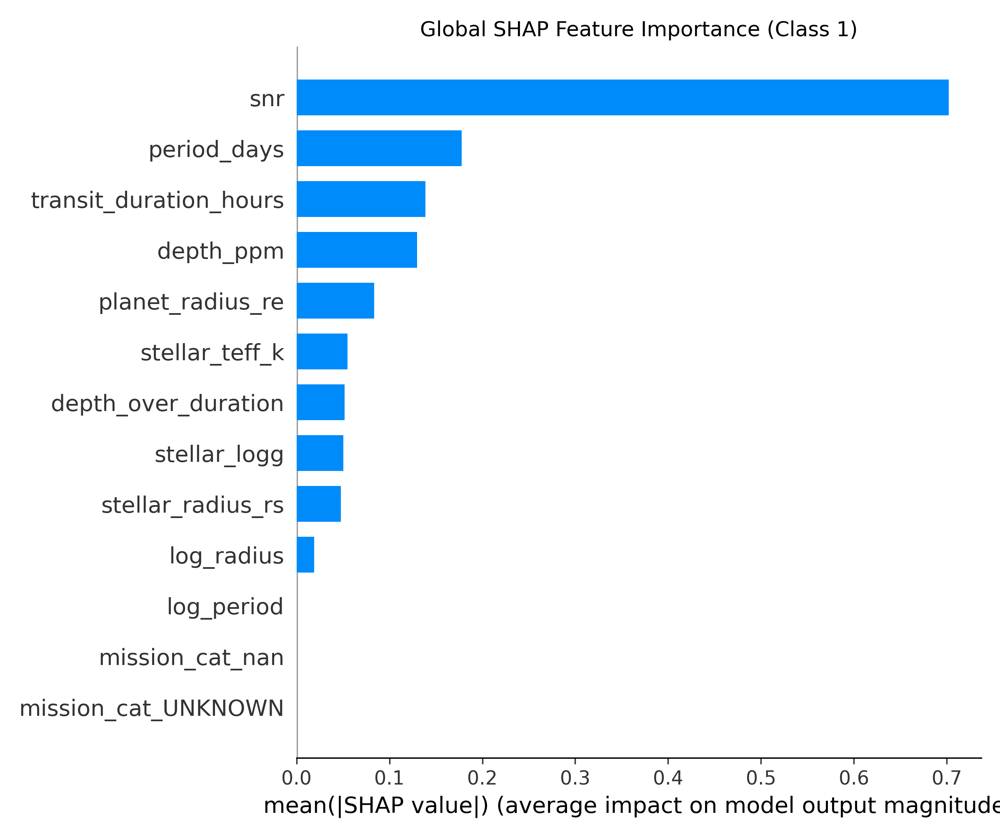
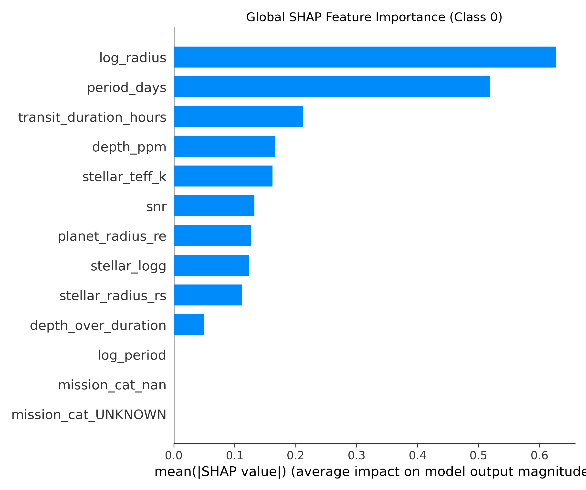
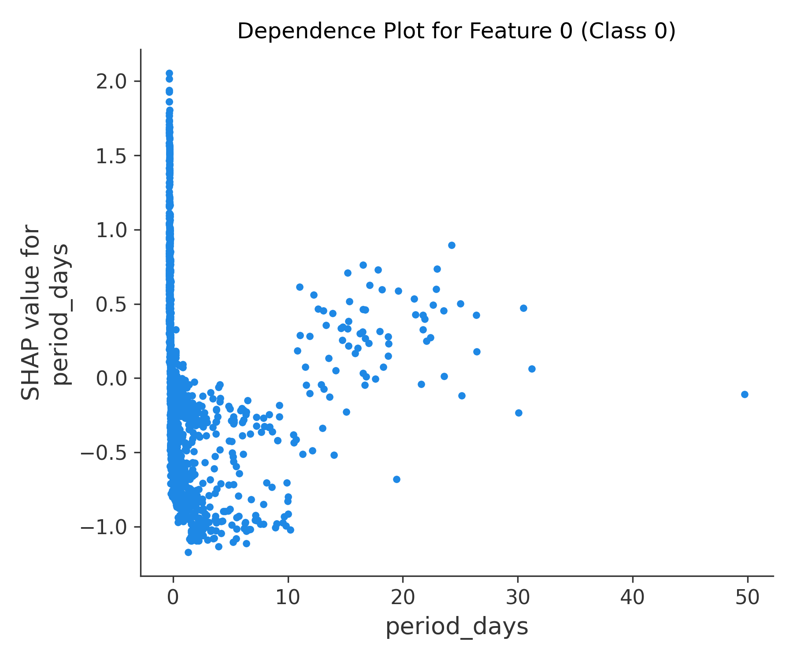
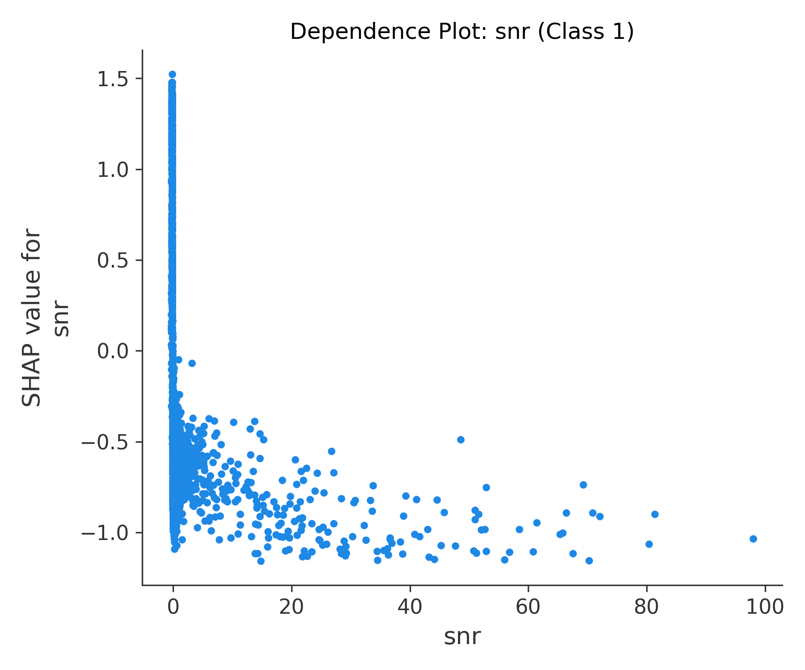
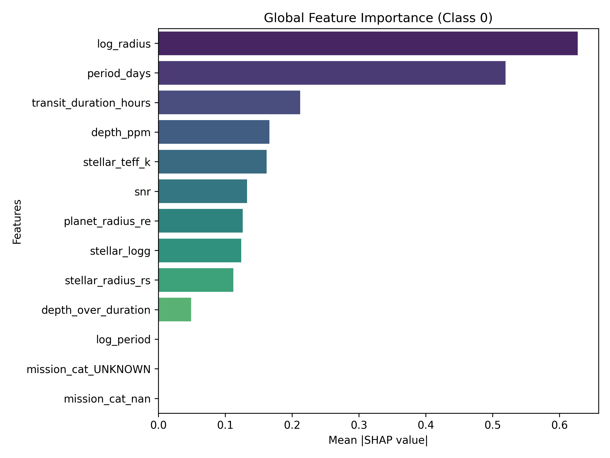
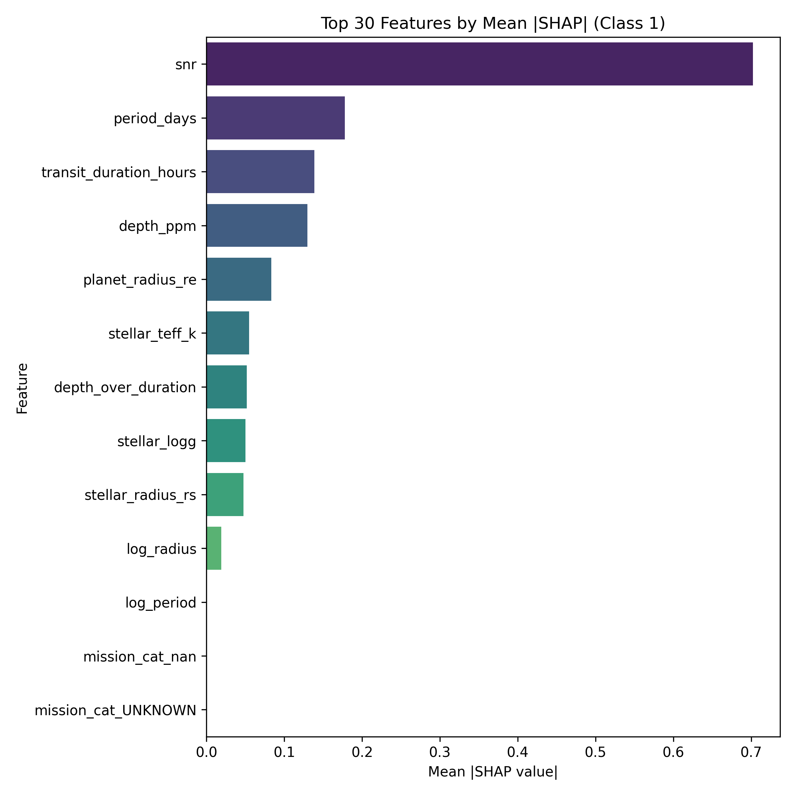
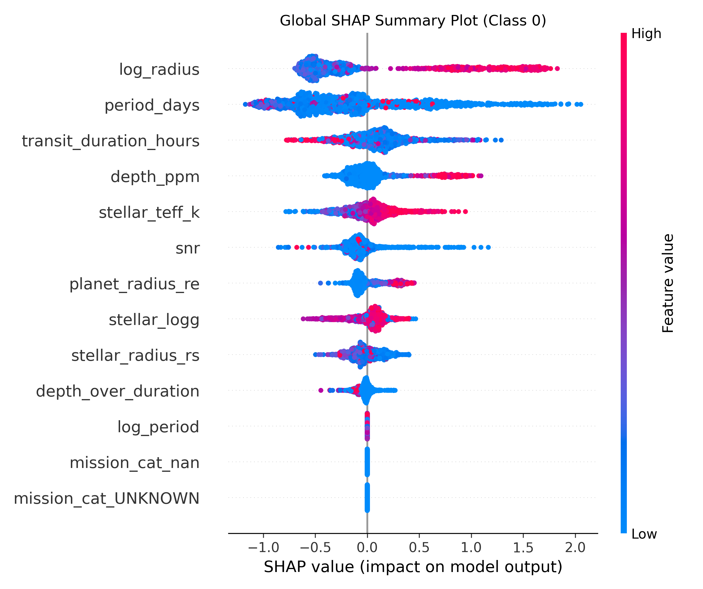
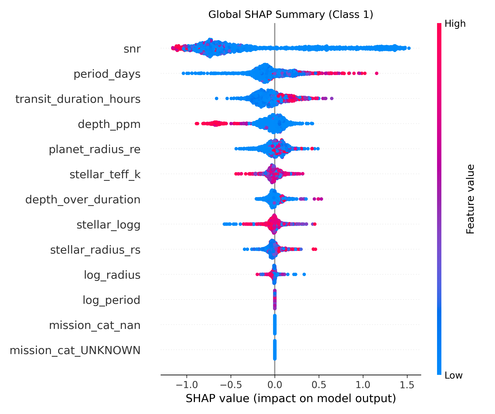

<div align="center">

# 🌌 Exoplanet Starfield Explorer

An integrated **React + Three.js** front end coupled with a **FastAPI** backend for **real-time exploration, classification, and explainability** of exoplanet candidates.

**Developed by the ExoNet Collective — a multidisciplinary team combining astrophysics, AI, and interaction design** to make exoplanet discovery more automated, transparent, and engaging.

ExoNet transforms NASA’s open exoplanet archives into interactive, explainable, and data-driven visual experiences. Our mission is to **accelerate automated planet detection while promoting scientific transparency and curiosity about distant worlds.**

> 💡 **Collaborate with us!** We welcome contributors in ML/AI, data engineering, web visualization, and science communication. If you’re passionate about translating cosmic data into human understanding, this project is for you.

</div>

---

## 🚀 Motivation

NASA’s missions (Kepler, K2, TESS, and beyond) have produced vast catalogs of potential exoplanets — many identified manually.  
**ExoNet** addresses this challenge by automating classification and habitability inference through machine learning, while providing **explainable AI (XAI)** insights via **SHAP (SHapley Additive exPlanations)**.  

This repository unifies **data ingestion**, **AI inference**, **SHAP visualization**, and **interactive 3D exploration** into a single reproducible research environment.

---

## ✨ Key Features

- **Interactive 3D Starfield** — Navigate Kepler/TESS regions in 3D space using Three.js.
- **Integrated Explainability** — Every model prediction is accompanied by multiple SHAP visualizations.
- **Dual AI Models** — XGBoost classifier for planetary disposition and a logistic meta-model for habitability.
- **Instant Data Uploads** — Import new datasets (CSV/JSON) with automatic feature harmonization.
- **Backend Health Feedback** — Frontend navbar continuously tracks API status.
- **Research-Grade Transparency** — Clear mapping from input features → model inference → SHAP visualization.

---

## 🧠 Explainable AI (SHAP Visual Suite)

SHAP (SHapley Additive exPlanations) quantifies how each feature contributes to the model’s output, enabling transparent, interpretable AI for astrophysical classification.

### 🔍 Workflow

1. **Inference Request** — Frontend triggers `/classify` or `/habitability`.
2. **Computation** — Backend computes SHAP values for all features.
3. **Visualization** — Multiple SHAP plots are generated under  
   `backend/Model/static/shap/` and displayed inline in the UI.

### 📊 SHAP Visual Outputs

Each image represents a distinct interpretability perspective:

| Visualization | File | Description |
|----------------|------|-------------|
| **Bar Plot (Class 1)** | `shap_bar_class1.png` | Average absolute feature impact for positive class. |
| **Bar Plot (Class 0)** | `shap_barplot_class0.png` | Average feature importance for negative/non-planet class. |
| **Dependence Plot (Feature 0)** | `shap_dependence_feature0.png` | SHAP dependence of the first feature vs. its value. |
| **Dependence Plot (SNR – Class 1)** | `shap_dependence_snr_class1.png` | Sensitivity of class 1 output to signal-to-noise ratio. |
| **Heatmap (Class 0)** | `shap_heatmap_class0.png` | Feature correlations and global SHAP intensity for class 0. |
| **Heatmap (Top 30 Class 1)** | `shap_heatmap_top30_class1.png` | High-impact feature subset for class 1 predictions. |
| **Summary Plot (Class 0)** | `shap_summary_class0.png` | Aggregated SHAP value distribution for non-planet outcomes. |
| **Summary Plot (Class 1)** | `shap_summary_class1.png` | Aggregated SHAP distribution for planet-candidate predictions. |

### 🖼️ Example Outputs

<div align="center">

<br>

<br>

<br>

<br>
</div>

Each plot provides complementary interpretability:
- **Bar / Summary:** global importance of each feature.
- **Dependence:** nonlinear relationships and feature interactions.
- **Heatmap:** correlations across high-impact features.
- **Waterfall:** detailed, per-prediction breakdowns.

---

---

## 🚀 Quick Start

**Requirements:**  
Node.js ≥ 18, Python 3.11+, npm/pip installed (virtualenv available in `env/`).

### 1️⃣ Backend (FastAPI)
```bash
cd backend
../env/bin/uvicorn backend.main:app --reload

## 🗺️ Project Structure

